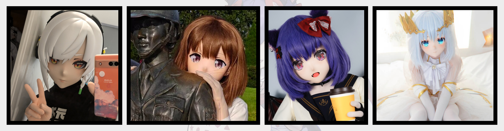

# Hello Kigurumi

> 本册内容，主要简单讲解 “二次元风格的 Kigurumi” 或是 “可穿戴的、二次元风格的、用于 COSPLAY 的人偶装” 及其衍生内容。若您对名词、定义有较为严苛需求的，请参阅 [Wiki 百科](https://zh.wikipedia.org/zh-hans/%E4%BA%BA%E5%81%B6%E6%89%AE%E6%BC%94)。

## 简介

Kigurumi （Animegao kigurumi）是一种二次元角色扮演（COSPLAY）形式。

- 通过佩戴面具、人偶装、假发等道具，将自己的外貌完全隐藏，以此来扮演动漫、游戏、虚拟角色。
- 通常，Kigurumi 玩家会选择一个虚拟角色，然后制作一个与之相似的面具、人偶装，以此来扮演这个角色。
- Kigurumi 玩家通常会在 COSPLAY 活动、展会、聚会等场合中亮相。

> 通过 Kigurumi 不需要依赖于自己的外貌，通过道具来扮演角色。
>
> “玩偶装里是真人哦！”

## 为什么玩 Kigurumi？

Q：“采访一下各位，为什么玩 kigurumi？”

- A：“有喜欢的角色，但是自己条件不足。” ——氢气易燃易爆炸
- A：“既然本体不是美少女 那就只能外挂套件变成美少女了” —— [帕鲁雨](https://x.com/Kiger_YuQing)
- A：“为了极致还原”——[刃下狼血](https://space.bilibili.com/193006350)
- A：“感觉 kig 给予了自己另一种可能性和身份”——[咔帕噗狸狸亚](https://x.com/Karly_Lilia)
- A：“最初倒是想当“临时”的“女孩子啦”，后面发现自己变完后那么可爱，就想着一定不能辜负了“这孩子”，于是就更加努力的去还原和贴近角色，希望能把角色展示在三次元里~大概就是那种让人真的在现实中看到了二次元角色的感觉”——[长庚伴月（千折）](https://x.com/TobiichiChisato)

大家选择入门 Kigurumi 的原因都不尽相同。有的喜欢角色扮演、有的想缓解压力、有的想找到一个新的身份。Kigurumi 也是多元、开放、包容的文化形式。

同时，有很多玩家自发的组织社群聚会被称为 “娃聚”，有的娃聚是为了交流道具制作技术、有的娃聚是为了拍摄照片、有的娃聚是为了集体参加动漫展会，也有的娃聚是为了聚餐、聊天、过生日。

## 一些好的条件

对于玩 Kigurumi，一些条件确实是存在优势、能够带来更好效果的。

- 有一定的**手工制作**能力，能够维护假发、饰品、服装、道具等；
- 有一些的**经济实力**，摄影装备、场地租赁、道具采购、活动参与等都需要一定的费用；
- 相对较好的**体力**，Kigurumi 面具的透气性相对局限；
- 有一定的**社交**能力，Kigurumi 玩家之间的交流、合作、互动都需要一定的社交能力；
- 相对良好的**身材**，对于 Kigurumi 的整体成本比较友好；

## 争议与风险

作为具有丰富、多样性的活动，Kigurumi 满足了不同人士、不同人群的复杂需求，也因此产生了一些争议、风险。

> 小知识
>
> SFW：Safe For Work，即无不良内容，适合工作环境。
>
> NSFW：Not Safe For Work，即不适合工作环境，可能包含色情、暴力、恐怖等内容。

Kigurumi 为制作 NSFW 内容提供了一定的便利，也因此产生了一些争议。在 Kigurumi 玩家中，也难免会存在一些行为违反公序良俗的现象，如性骚扰、人身攻击等，请各位入门的玩家注意辨别信息保护自己。

同时，Kigurumi 作为一种 COSPLAY 形式，也存在一定的风险。Kigurumi 玩家在佩戴面具时，视野受限，行动受限，容易发生意外。

## 总结

本节内容中，我们简单介绍了 Kigurumi 的定义、形式、特点、优势、风险等内容。Kigurumi 是一种多元、开放、包容的文化形式，适合不同人群、不同需求的人士。

您也可以通过阅读本手册的其他章节，了解更多关于 Kigurumi 的内容。
