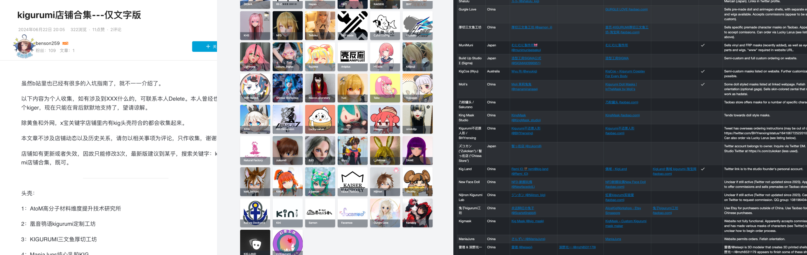
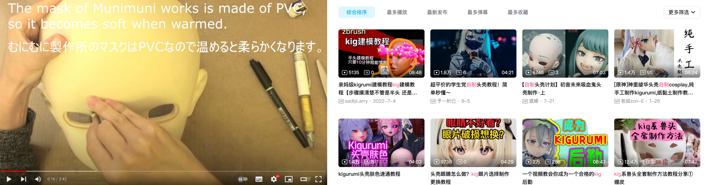

# 搞一套 KIGURUMI

> 本节仅浅显的介绍获取方式，具体的操作流程、注意事项、细节等内容将在后续章节中详细介绍。

得益于制造业的发展，在这个年代拥有 KIGURUMI 不再是困难，越来越多的精致、可爱、性价比高的 Kigurumi 产品出现在市面上，满足不同客户、不同场景下的需求。获取 Kigurumi 产品的方式主要有以下的几种：

- 找到专业的 Kigurumi 的工房、道具工作室定制；
- DIY
  - 部分 DIY 、部分委托假发造型、采购半成品、组件完成；
  - 完全 DIY 制作：从 3D 设计、增材、假发拼接、喷漆等全部自己完成；
- 通过二手交易、玩家转让等方式获取，或二手交易后**改造成自己喜欢的角色**；

在一般情况下，Kigurumi 的预算参考区间如下所示：（未涵盖时间成本）

- 专业工坊定制：**¥ 3000 - ¥5000 及以上**；
- DIY 部分委托：**¥ 2000 - ¥ 3000**；
- 二手交易：**¥ 2000 不等**；
- 完全 DIY 制作：**¥ 1000 - ¥ 2000**；

大家的目标不同，有的是想快速体验 Cosplay，有的倾向于体验 DIY 制作。

除此之外，还可以选购 “Kigurumi 专用打底衣” 或 “Kigurumi 肤色紧身衣”，这是一种皮肤色的紧身衣，由于人体肤色和 Kigurumi 面具的肤色不一致，所以需要穿上这种紧身衣，以便于 Kigurumi 的面具和紧身衣的过渡更加自然。一般价格在 ¥300 - ¥500 元不等。

## 专业工坊

专业工坊是指专业制作 Kigurumi 的工作室，他们通常会提供一站式服务，包括头壳、紧身衣、假发、眼镜、鞋子等。这些工坊通常会有自己的设计师、制作师、销售人员，他们会根据客户的需求提供定制服务。

可以通过社区专业的测评内容来了解主流工坊的产品、服务、质量、交付周期等信息，了解工坊的口碑。例如：

- [B 站：kigurumi 店铺合集---仅文字版 https://www.bilibili.com/read/cv35707159 ](https://www.bilibili.com/read/cv35707159)
- [B 站：KIGURUMI⑦ 咕噜米入坑装备购买浅略指南 https://www.bilibili.com/read/cv33331306](https://www.bilibili.com/read/cv33331306)
- [贴吧：kigurumi 店铺合集 https://tieba.baidu.com/p/9120197023](https://tieba.baidu.com/p/9120197023)

也有很多专业做 Kigurumi 制作者店铺评测列表的网站：

- [**kigudb.info** - KiguDB 收录了许多玩家作品，同时也收录作品的工坊的信息](https://kigudb.info/zh)
- [**makers.kig-o.com** - Kigurumi Mask Makers（英文）由 Celes Halcyon 维护的网站，上面记录了工坊作者信息](https://makers.kig-o.com/)
- [**kigguide.com**（英文）kigguide - 一个致力于 Kigurumi 亚文化的小网站](https://kigguide.com/)
- [**kigurumi-animegao.fr** - 由 Odd_HD 与 Schizu_Emyu 合作托管和开发，旨在汇总与 kigurumi 爱好相关的信息](https://kigurumi-animegao.fr/)

> 如果预算充足，并且目标明确在 “我更想要体验 Cosplay”、“拍摄摄影作品”、“参加展会” 等情况下，建议选择专业工坊定制。制作加工的工期、进展比较充满确定性，可以更好的控制预算，品质有保障。

## DIY

DIY 是指 Do It Yourself，即自己动手制作。

工坊店家有时候不会承接所有的角色定制委托，他们会根据实际生产情况放弃一些顾客的需求。目前有很多玩家选择 DIY 制作 Kigurumi，这样可以更好的体验到制作的乐趣，也可以根据自己的需求、喜好来定制 Kigurumi。

Kigurumi 的主体部分能够通过 DIY 来完成的部分：

1. 壳体：3D 设计、制造、喷漆（也有很多不局限于 3D 打印 的方式）；
2. 假发：拆分、拼接、修剪、造型；
3. 壳面妆造：眼睛、眼妆、眼影腮红等面部细节；

在 DIY 方面也有很多玩家分享了自己的经验、技巧、心得。可以通过社区、论坛、博客、视频等方式获取 DIY 制作 Kigurumi 的相关信息。

> 本章节仅简单介绍了一些 DIY 制作 Kigurumi 的过程，在 DIY 过程中会涉及五官比例等美术知识，也会涉及到一些化妆、喷漆等技巧，建议在 DIY 之前先了解一些相关的知识。具体的 DIY 制作流程、技巧、注意事项等内容将在后续章节中详细介绍。

壳体部分的制作，可以通过 3D 建模工具（如：Blender、Zbrush）建模、3D 打印、喷漆等方式来完成，同时在二手交易市场上也能获取到一些半成品的壳体，或者通过网络上的开源模型来获取壳体后 3D 打印。

假发部分的制作，可以通过购买传统的 Cosplay 假发、修剪、拼接、造型等方式来完成。拼接的过程可以自制假发发网，也可以直接通过热熔胶粘连到壳体上，符合基本的头发朝向、长度即可后续造型。同时也可以寻找在 Cosplay 社群中，提供专业造型服务的玩家，委托他们来完成假发的造型。

壳面妆造部分的制作，可以通过丙烯、模型水贴、薄 EVA 完成基本妆造，使用彩铅辅助，色粉实现腮红、眼影等效果，消光清漆定妆。

## 二手交易

在一些二手交易平台、社区、论坛上，也有一些玩家会出售自己的 Kigurumi 产品，这些产品可能是自己不再使用、不再喜欢的角色，也可能是自己 DIY 制作的产品。这种方式相对来说比较便宜，适合具有丰富经验的玩家。如果您满足下面的条件，可以考虑通过二手交易的方式获取 Kigurumi：

1. 了解二手交易市场、交易规则、交易风险；
2. 了解 Kigurumi 的店家、品质、价格；
3. DIY 经验丰富，能够对二手产品进行改造、维护；
4. 有一定的经济实力、时间、经历，能够承担一定的风险；
5. 有一定的社区、论坛、博客、视频等资源，能够获取到二手交易信息；
6. 有一定的社交能力，能够与卖家、买家进行有效的沟通、交流；

> 任何二手市场产品价格取决于产品的流动性、供需关系等关键因素。

Kigurumi 的独特之处在于：“交付前存在较大不确定性，而交付后却有很高的确定性。”

作为一个小众市场，一旦某个角色成功交付并效果理想，往往会吸引更多关注和需求，促进二手市场的活跃。然而，二手价格的“保值”仍存在不确定性————越来越多新用户的加入和新店家的出现，热门角色的需求增加、热门角色的保有量也正在增长，随着时间发展店家的交付确定性也随之增强，这将对二手市场的产品价格产生冲击。当然未来也会有“奢侈品级”的店家出现，该类型的产品资产价值支撑的确定性较好。**不过不建议将 Kigurumi 视为投资品，因为其价值的确定性较低**。

另外，对于目标是 “改造成新角色” 的玩家而言，只需关注产品的质量和改造成本即可，不必过于关注产品的颜值，也许通过自己的改造，能够让产品焕发新的生机。

## 总结

本章节通过专业工坊、DIY、二手交易三种方式介绍了获取 Kigurumi 的途径，每种方式都有其适用的场景、适用的人群。在选择获取 Kigurumi 的方式时，需要根据自己的需求、经济实力、经验、时间、社交能力等因素来综合考虑。
